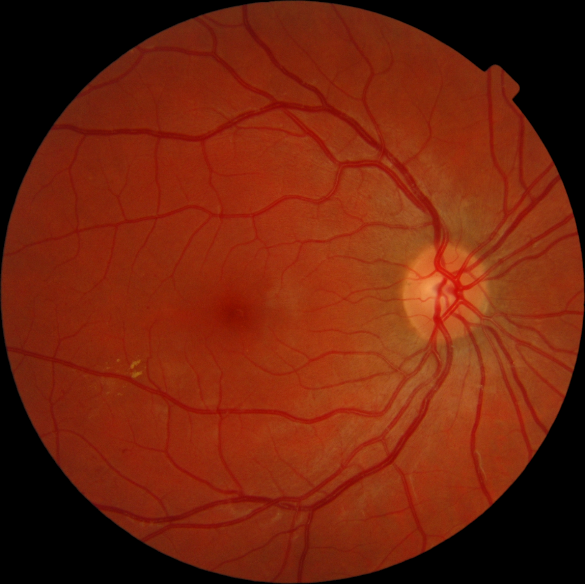
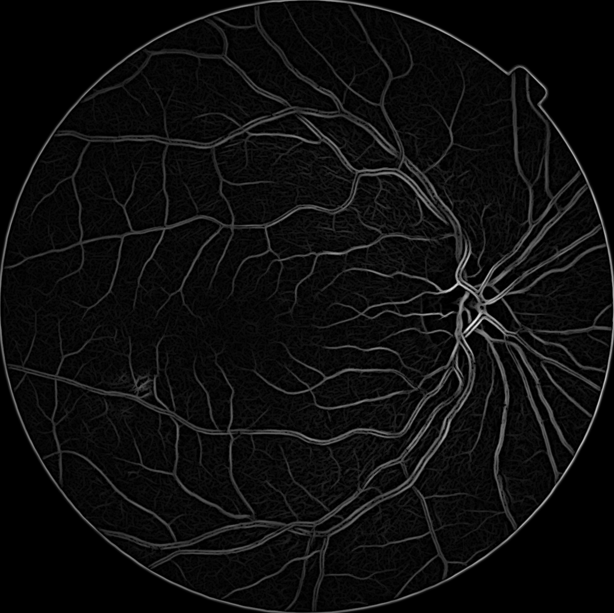

# A Python implementation of BCOSFIRE  


<p align="center">
  <a href="./data/sample_0.png">
    
    
  </a>
</p>

<!-- TABLE OF CONTENTS -->
<details open="open">
  <summary>Table of Contents</summary>
  <ol>
    <li>
      <a href="#about-the-project">About The Project</a>
      <ul>
        <li><a href="#built-with">Built With</a></li>
      </ul>
    </li>
    <li>
      <a href="#getting-started">Getting Started</a>
      <ul>
        <!-- <li><a href="#prerequisites">Prerequisites</a></li> -->
        <li><a href="#installation">Installation</a></li>
      </ul>
    </li>
    <li><a href="#usage">Usage</a></li>
    <li><a href="#roadmap">Roadmap</a></li>
    <li><a href="#contributing">Contributing</a></li>
    <li><a href="#license">License</a></li>
    <li><a href="#contact">Contact</a></li>
    <!-- <li><a href="#acknowledgements">Acknowledgements</a></li> -->
  </ol>
</details>

<!-- ABOUT THE PROJECT -->
## About The Project

This is a Python implementation of the B-COSFIRE algorithm, which was originally posted [here](https://de.mathworks.com/matlabcentral/fileexchange/49172-trainable-cosfire-filters-for-curvilinear-structure-delineation-in-images).

B-COSFIRE aims to detect elongated patterns in images such as blood vessels in retinal images. It uses the existing COSFIRE (Combination Of Shifted Filter Responses) algorithm to get orientation selectivity. More specifically, the algorithm computes the weighted geometric mean of the output of a pool of Difference-of-Gaussians filters to detect vessel-like patterns in images, see the algorithm details in [paper](http://dx.doi.org/10.1016/j.media.2014.08.002).

### Built With
You need `python3` for this project. 

<!-- GETTING STARTED -->
## Getting Started
To get a local copy, you can follow the following steps.
### Installation
You can install the repository and required Python packages by following the steps below.

1. Clone the repo
  ```sh
  git clone https://github.com/Brains-for-hire/diabetic-retinopathy/tree/master/cosfire
  ```
2. Install required packages
  ```sh
  pip3 install -r requirements.txt
  ```
<!-- USAGE EXAMPLES -->
## Usage
To run the BCOSFIRE algorithm on the sample image `./data/sample_0.tif`, you can run the following command in the terminal.
  ```sh
  python3 BCOSFIRE.py ./data/sample_0.tif
  ```

<!-- ROADMAP -->
## Roadmap
See the [open issues](./issues) for a list of known issues.

<!-- CONTRIBUTING -->
## Contributing

Any contributions are **greatly appreciated**.

Contributions might include anything which make the code being more efficient and yielding better results. 

1. Fork the Project
2. Create your Feature Branch (`git checkout -b feature/AmazingFeature`)
3. Commit your Changes (`git commit -m 'Add some AmazingFeature'`)
4. Push to the Branch (`git push origin feature/AmazingFeature`)
5. Open a Pull Request

<!-- LICENSE -->
## License

Distributed under the *BSD-3-Clause License*. See `LICENSE` for more information.

<!-- CONTACT -->
## Contact

Project Link: [https://github.com/Brains-for-hire/diabetic-retinopathy](https://github.com/Brains-for-hire/diabetic-retinopathy)